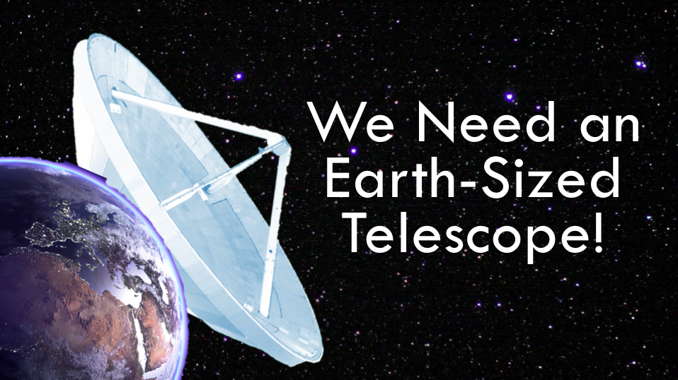
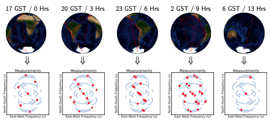
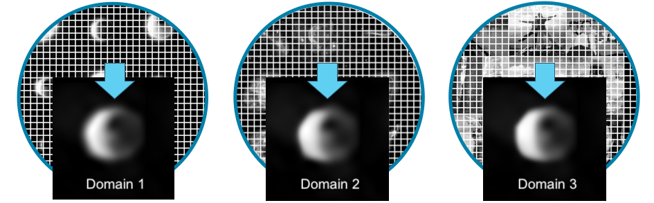
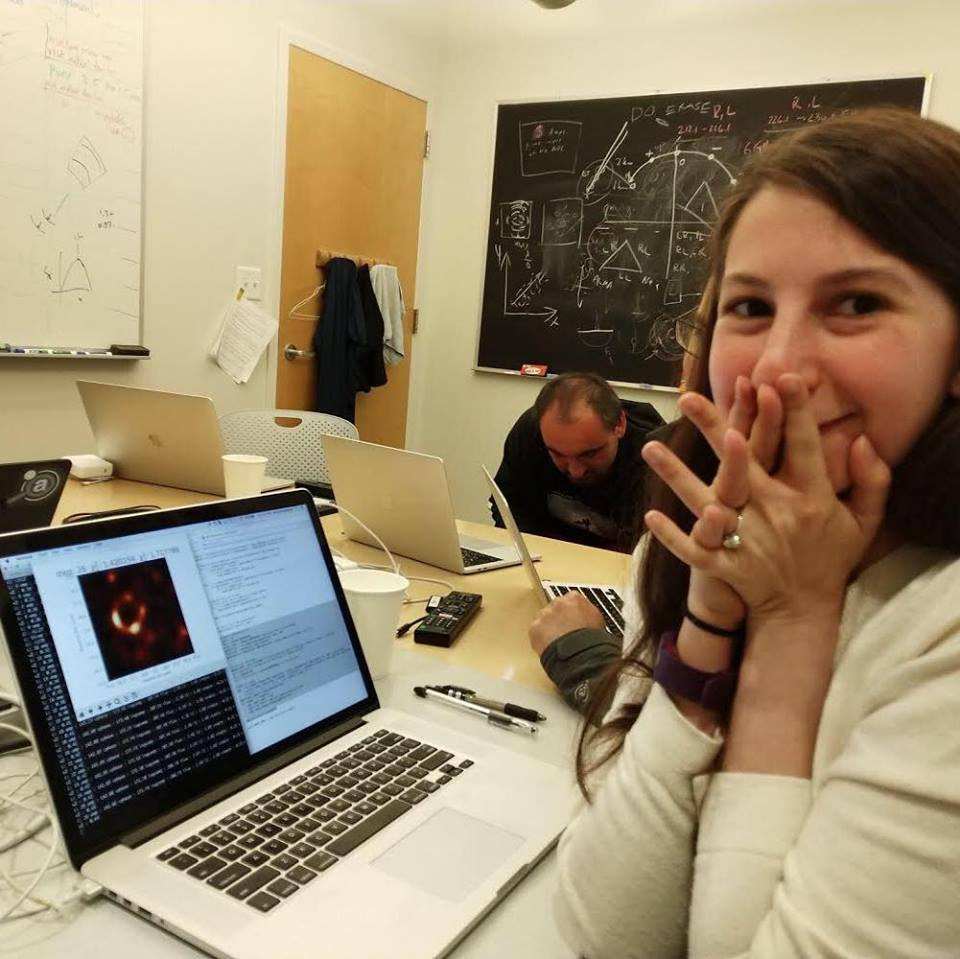
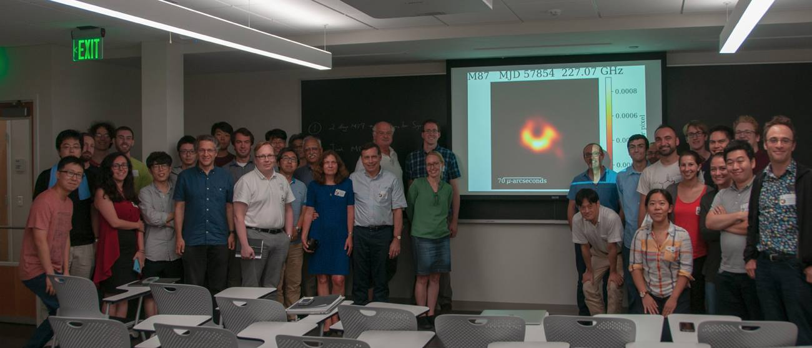

+++
title = "How we ended up having a picture of a black hole"
subtitle = ""

math = true

# Add a summary to display on homepage (optional).
summary = "Summary of the workd done to have the first-ever image of a black hole."

date = 2019-04-11T15:11:18+02:00
draft = true

# Authors. Comma separated list, e.g. `["Bob Smith", "David Jones"]`.
authors = []

# Is this a featured post? (true/false)
featured = false

# Tags and categories
# For example, use `tags = []` for no tags, or the form `tags = ["A Tag", "Another Tag"]` for one or more tags.
tags = ["Algorithms", "Astronomy", "Computer Vision"]
categories = []

# Projects (optional).
#   Associate this post with one or more of your projects.
#   Simply enter your project's folder or file name without extension.
#   E.g. `projects = ["deep-learning"]` references 
#   `content/project/deep-learning/index.md`.
#   Otherwise, set `projects = []`.
# projects = ["internal-project"]

# Featured image
# To use, add an image named `featured.jpg/png` to your page's folder. 
[image]
  # Caption (optional)
  caption = ""

  # Focal point (optional)
  # Options: Smart, Center, TopLeft, Top, TopRight, Left, Right, BottomLeft, Bottom, BottomRight
  focal_point = ""

  preview_only = true

+++

So.. this is a black hole. It's pretty cool, isn't it?

Specifically, this is the supermassive black hole inside the core of Messier 87 (M87), a giant elliptical galaxy located in a constellation called Virgo.

The black hole in the center of M87, let's call it M87\*, is about 53 million light-years away from us, and it's much larger than the black hole in the center of our own galaxy: Sagittarius A* (26k light-years from Earth). Models predict that M87* has a mass between 3 to 6 billion solar masses while Sagittarius A* has a mass of "only" 4 million solar masses.

### A brief history of black holes

A black hole is a great amount of matter packed into a very small area - think of a star ten times more massive than the Sun squeezed into a sphere approximately with the diameter of your city. The result is a gravitational field so strong that nothing, not even light, can escape.

Black holes were predicted by Einstein in 1916 when he published his famous Theory of General Relativity.

This theory described gravity as a curvature of a four-dimensional spacetime (3 space dimensions and 1 time dimension). In particular, it explains how massive objects (such as planets or stars) deform spacetime and how this affects the path of other objects and light around them.

GR also predicted that when a massive star dies, it leaves behind a small, dense remnant core. If the core's mass is more than about three times the mass of the Sun the force of gravity overwhelms all other forces and produces a black hole.

In the years since GR was first proposed, scientists have found a fair amount evidence in support of the theory but it's not known whether this theory still holds in the extreme conditions with much more massive objects, such as a black hole, where the spacetime curvature is predicted to be extremely strong.

### Event Horizon Telescope and VLBI
The Event Horizon Telescope (EHT), named after the point of no return "event horizon" of a black hole, is an international project whose goal is to
take the first image of the immediate environment around a black hole and verify if GR holds in extreme conditions.

But how do you take a picture of something that doesn’t radiate light? 

Rather than looking directly at the black hole itself, the EHT looks at gas surrounding it to take an image of its shadow. Specifically, researchers looked at the event horizon, the limit beyond which light can no longer escape the intense gravity of the black hole. The gas in this area heats up to billions of degrees, creating a silhouette whose shape should be predicted by GR. So far, the Event Horizon Telescope’s observations are in line with what Einstein anticipated.

That shadow is revealed in the center of the picture against a backdrop of glowing light that is being pulled in by the black hole’s massive gravity. You’ll notice one side of the image is actually brighter than the other. That is because of the black hole’s orientation relative to Earth. The brighter side is the one rotating toward Earth, meaning the particles are being thrown toward our planet faster on that edge, making them appear to glow brighter.

In order to take the first image of a black hole, astronomers predict we require a
telescope with a resolution of about $20$ µ-arcseconds for a wavelength of $1.3$ millimeters ($230$ GHz). In fact, due to the phenomenon of diffraction, the size of the smallest object we can observe is inversely proportional to the size of the telescope we use. For example, trying to see Sagittarius A\* in the sky with the most powerful optical telescope we have is like trying to find an orange on the surface of the moon.

If we wanted to take the image of a black hole with a traditional single-dish telescope we would need an Earth-sized dish!

The EHT is composed of many radio telescope facilities around the world to produce a high-sensitivity, high-angular-resolution telescope. Through the technique of very-long-baseline interferometry (VLBI), many independent radio antennas separated by hundreds or thousands of miles can be used together to create a virtual telescope with an effective diameter of the entire planet.

VLBI alleviates the need for building an impossibly large single-dish telescope by simultaneously observing a common source from an array of telescopes distributed around the Earth. This would be a prohibitively small number of measurements to make an image from, however, as the Earth rotates, the projected baselines change, and we observe new measurements.

This technique makes it possible to emulate samples from a single-dish telescope with a diameter equal to the maximum distance between telescopes in the array, at the expense of having to handle missing data.

For those wondering, the volume of data generated for this experiment is in the order of 4 petabytes (4 million billion bytes), and they used airplanes to move the data from different stations to the US.

### CHIRP
Reconstructing an image using VLBI measurements is an ill-posed problem (not [well-posed](https://en.wikipedia.org/wiki/Well-posed_problem)) and relies heavily on assumptions made about the underlying image. There are an infinite number of possible images that explain the data, the challenge is to find an explanation that respects these prior assumptions while still satisfying the observed data.

CHIRP (Continuous High-resolution Image Reconstruction using Patch
priors) is an imaging method developed specifically to handle the challenges faced in the EHT’s data, it takes the data collected by telescopes around the world and figures out the most likely picture that fits the data.

But how do we handle missing data?

Let's pretend you have different sets of images, each set from a different domain (a set of images of animals, a set of images of food, a set of images of simulations of black holes, ..). You can take each set and cut every image into a lot of different pieces, like a puzzle. Now, you can try to take commonly used pieces from a set and use them to fill the gap in the picture of your black hole, of course every time you need to choose a piece you should try to choose the one with the higher probability of beeing there based on the "nearest real measurements" you have. 

The idea is that, based on the domain you use, you would get different kinds of reconstruction on your image. For example, if you choose the domain of "images of simulations of black holes" you should have a reconstruction of a black hole similar to what you originally expected. But, if the reconstructions obtained using every set of "puzzle pieces" are similar, then you can be pretty confident of your result.

In the experiment, to guarantee the accuracy of the final result, four different teams independently used the algorithm to obtain an image. After a month of work, the four groups presented their results to the other teams.

"I saw all the other teams had images that were very similar, with the lower half brighter than the top half. It was amazing to see everyone got that. That was the happiest moment I've ever had."

### Conclusion
The most beautiful thing about moments like this is that more than 200 scientists from all over the world worked on the experiment. In some ways, these are the only moments in which humans really stand together, trying to pursue goals that seem impossible, and once again achieving it.

### References
* [Prof. Bouman's PhD thesis](https://people.csail.mit.edu/klbouman/pw/papers_and_presentations/thesis.pdf)
* [Prof. Bouman's TEDx talk](https://www.youtube.com/watch?v=BIvezCVcsYs)
* [MIT Technology Review](https://www.technologyreview.com/s/613301/this-is-the-first-ever-photo-of-a-black-hole/)
* [EHT on Wikipedia](https://en.wikipedia.org/wiki/Event_Horizon_Telescope)
* [General Relativity on Wikipedia](https://en.wikipedia.org/wiki/General_relativity)
* [Black holes on Wikipedia](https://en.wikipedia.org/wiki/Black_hole)
* [M87 on Wikipedia](https://en.wikipedia.org/wiki/Messier_87)
* [VLBI on Wikipedia](https://en.wikipedia.org/wiki/Very-long-baseline_interferometry)
* [EHT-imaging on Github](https://achael.github.io/eht-imaging/)