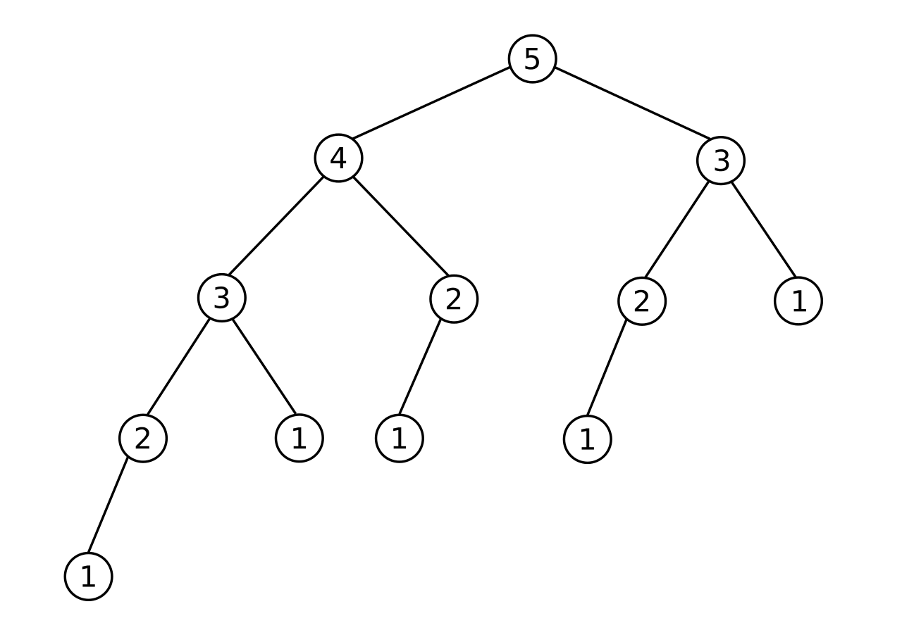
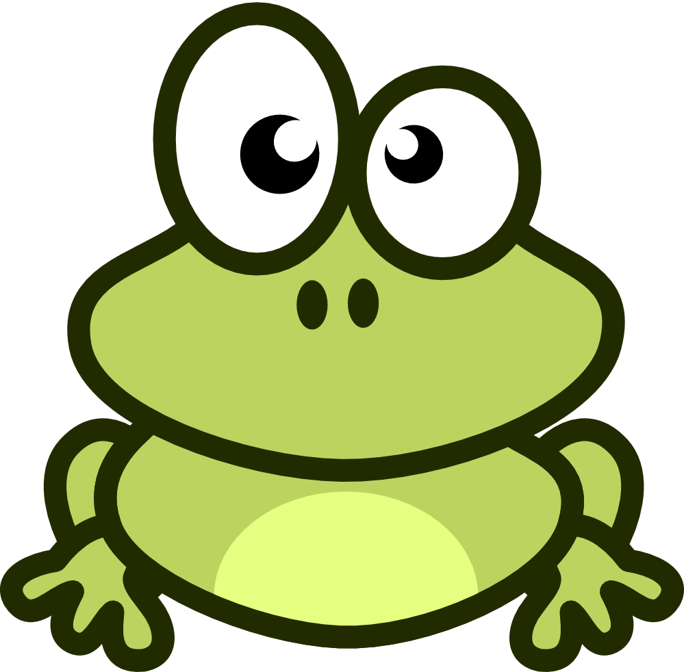

+++
title = "Dynamic Programming"
subtitle = ""

math = true

# Add a summary to display on homepage (optional).
summary = "Just some random notes about Dynamic Programming"

date = 2019-04-08T13:21:02+02:00
draft = false

# Authors. Comma separated list, e.g. `["Bob Smith", "David Jones"]`.
authors = []

# Is this a featured post? (true/false)
featured = false

# Tags and categories
# For example, use `tags = []` for no tags, or the form `tags = ["A Tag", "Another Tag"]` for one or more tags.
tags = ["Algorithms"]
categories = []

# Projects (optional).
#   Associate this post with one or more of your projects.
#   Simply enter your project's folder or file name without extension.
#   E.g. `projects = ["deep-learning"]` references 
#   `content/project/deep-learning/index.md`.
#   Otherwise, set `projects = []`.
# projects = ["internal-project"]

# Featured image
# To use, add an image named `featured.jpg/png` to your page's folder. 
[image]
  # Caption (optional)
  caption = ""

  # Focal point (optional)
  # Options: Smart, Center, TopLeft, Top, TopRight, Left, Right, BottomLeft, Bottom, BottomRight
  focal_point = ""
+++

### Introduction
The topic of *dynamic programming* sounds really fancy and obscure but it's not a big deal afterall :)

DP problems usually appear in your favourite course on Algorithms and Data Structure, in Algorithmic Competitions or in Technical Interviews, but it also has lots of real life applications, we will see some of them at the end of this blog post.

### What is DP?
We first need to introduce the concept of *divide-and-conquer*.

*Divide-and-conquer* is a technique for solving a complex problem by breaking it down into a collection of simpler sub-problems until these become simple enough to be solved directly. The solutions to the sub-problems are then combined to give a solution to the original problem.

Some examples of the application of this techinque are:

* [Binary Search](https://en.wikipedia.org/wiki/Binary_search_algorithm)
* [Euclidean Algorithm for computing the GCD](https://en.wikipedia.org/wiki/Euclidean_algorithm)
* [Merge Sort](https://en.wikipedia.org/wiki/Merge_sort)
* [Fast Fourier Transform](https://en.wikipedia.org/wiki/Fast_Fourier_transform)

But.. what if we have a lot of overlapping sub-problems? Do we really need to compute them everytime?

A clear example of this is in the computation of the n-th Fibonacci number.

For those who don't remember, the n-th Fibonacci number is expressed by the following recurrence:

$
  F(n)=\begin{cases}
    0, & \text{if $n=0$}. \newline
    1, & \text{if $n=1$} \newline
    F(n-1) + F(n-2), & \text{if $n>1$}.
  \end{cases}
$

And this is the tree generated by calling $F(5)$:
 

The concept of *dynamic programming* is really simple, **once we have a recursive formulation of the problem** (and sometimes this is not a pieace of cake) let's just store the solution to each sub-problem so that each sub-problem is only solved once.

### Example
###### Frog1 from the [Educational DP Contest](https://atcoder.jp/contests/dp) by AtCoder
There are $N$ stones, numbered $1, 2, ..., N$. For each $i$ ($1 \leq i \leq N$) the height of the stone $i$ is $h_i$.

There is a frog who is initially on stone $1$. The frog will repeat the following action some number of times to reach stone $N$:

* If the frog is currently on stone $i$, jump to stone $i + 1$ or $i + 2$. Here, a cost of $|h_i - h_j|$ is incurred, where $j$ is the stone to land on.

Find the minimum possible total cost incurred before the frog reaches stone $N$.
 
###### Mathematical formulation
$
\small
  f(i)=\begin{cases}
    0, & \text{if $i=1$} \newline
    |h[i| - h[i-1]|, & \text{if $i=2$} \newline
    min(|h[i| - h[i-1]| + f(i-1), |h[i| - h[i-2]| + f(i-2)), & \text{if $i>2$}
  \end{cases}
\normalsize
$
###### Recursion with memoization (or top-down approach)

```cpp
int solve(int i) {
    if(dp[i] != -1) return dp[i];
    if(i == 1) return 0;
    else if(i == 2) return abs(h[i] - h[i-1]);
    else return dp[i] = min(abs(h[i] - h[i-1]) + solve(i-1), abs(h[i] - h[i-2]) + solve(i-2));
}
```

Initially $dp[i] = -1$ with $1 \leq i \leq N$, $solve(N)$ will give you the solution.

The complexity of this approach is linear in $N$, without memoization it's exponential.

### A bottom-up approach
You can also think of dynamic programming as a "table-filling" algorithm. 

Once we formulate the solution to a problem recursively as in terms of its sub-problems, we can try reformulating the problem in a bottom-up fashion: try solving the sub-problems first and use their solutions to build-on and arrive at solutions to bigger sub-problems. This is also usually done in a tabular form by iteratively generating solutions to bigger and bigger sub-problems by using the solutions to small sub-problems.

###### Bottom-up solution to Frog1
```cpp
for(int i = 1; i <= N; i++) {
    if(i == 1) dp[i] = 0;
    if(i == 2) dp[i] = abs(v[i] - v[i-1]);
    else dp[i] = min(abs(v[i] - v[i-1]) + dp[i-1], abs(v[i] - v[i-2]) + dp[i-2]);
}
```

You will find the solution in $dp[N]$.